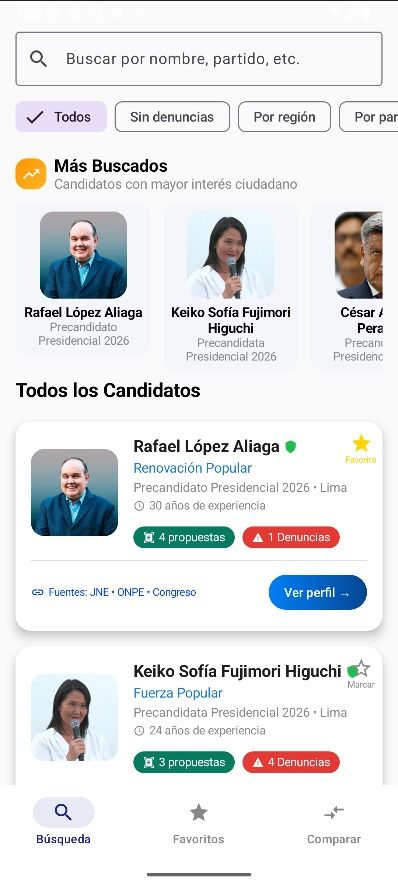
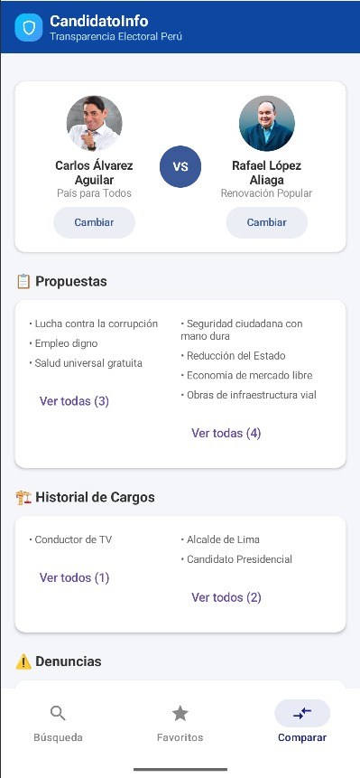

# AppElectoral - Transparencia Electoral Ciudadana

**AppElectoral** es una aplicación móvil que permite a los ciudadanos peruanos consultar información pública sobre los candidatos al Congreso y la Presidencia del Perú. La aplicación centraliza datos de múltiples fuentes oficiales.

---

## 👥 Equipo de Desarrollo

| Rol | Nombre | Responsabilidades |
|-----|--------|-------------------|
| **Líder Técnico** | Sergio Serva | Arquitectura del proyecto, base de datos (Room), gestión de GitHub, coordinación del equipo |
| **Diseñadora UI/UX** | Yamile Ochoa | Prototipo en Figma, diseño de interfaz, implementación de pantallas, sistema de navegación |
| **Documentador/Gestor de Datos** | Josep Rivera | Investigación de fuentes oficiales, documentación del proyecto, creación y gestión del archivo JSON con datos de candidatos |

**Curso:** Aplicaciones Móviles con Android  
**Docente:** Juan León S.  
**Duración:** 6 días

---

## Fuentes de Información Pública Investigadas

### 1. JNE - Jurado Nacional de Elecciones
- **URL Principal:** https://www.jne.gob.pe
- **Plataformas Especializadas:**
  - Plataforma Electoral: https://plataformaelectoral.jne.gob.pe
  - Voto Informado: https://votoinformado.jne.gob.pe
- **Información Disponible:**
  - Hojas de vida completas de candidatos
  - Planes de gobierno por organización política
  - Sentencias por delitos electorales
  - Resoluciones y proclamaciones oficiales
  - Declaraciones juradas de candidatos

### 2. Infogob - Observatorio para la Gobernabilidad
- **URL:** https://infogob.jne.gob.pe
- **Información Disponible:**
  - Historial político completo desde 1931
  - Historial partidario de candidatos
  - Cargos públicos anteriores (municipales, regionales, congresales)
  - Resultados electorales históricos
  - Trayectoria de afiliación a organizaciones políticas

### 3. ONPE - Oficina Nacional de Procesos Electorales
- **URL Principal:** https://www.onpe.gob.pe
- **Plataformas:**
  - Sistema Claridad: https://claridad.onpe.gob.pe
  - Datos Abiertos: https://www.onpe.gob.pe/elecciones/
- **Información Disponible:**
  - Resultados electorales en tiempo real
  - Financiamiento de campañas políticas
  - Aportes, ingresos y gastos electorales
  - Datos descargables en formatos CSV/XLSX

### 4. Poder Judicial del Perú
- **URL Principal:** https://www.pj.gob.pe
- **Plataformas:**
  - CEJ - Consulta de Expedientes: https://cej.pj.gob.pe/cej/forms/busquedaform.html
  - REDAM (Deudores Alimentarios): https://casillas.pj.gob.pe/redam/
- **Información Disponible:**
  - Expedientes judiciales por DNI o nombre
  - Sentencias y resoluciones judiciales
  - Registro de Deudores Alimentarios Morosos

### 5. Contraloría General de la República
- **URL Principal:** https://www.contraloria.gob.pe
- **Plataformas:**
  - Sistema de DDJJ: https://apps1.contraloria.gob.pe/ddjj/
  - Portal Ciudadano: https://serviciosenlinea.contraloria.gob.pe/
- **Información Disponible:**
  - Declaración Jurada de Ingresos, Bienes y Rentas
  - Declaración Jurada de Intereses
  - Información patrimonial histórica de funcionarios

### 6. Congreso de la República
- **URL Principal:** https://www.congreso.gob.pe
- **Plataformas:**
  - Proyectos de Ley: https://www.congreso.gob.pe/proyectosdeley
  - Asistencias y Votaciones: https://www.congreso.gob.pe/AsistVotPlenoPermanente/
- **Información Disponible:**
  - Proyectos de ley presentados por congresista
  - Votaciones nominales registradas
  - Asistencia a sesiones plenarias
  - Informes de gestión parlamentaria

---

## 🎨 Prototipo de Diseño

**Enlace a Figma:** [AppElectoral - Prototipo UI/UX](https://www.figma.com/design/vVHL6YPTLcVYzOJ4ChxqX3/AppElectoral?node-id=0-1&t=14cjhsqe2e7whMER-1)

### Pantallas Principales

El prototipo incluye las siguientes pantallas diseñadas siguiendo principios de Material Design 3:

1. **HomeScreen** - Pantalla principal con búsqueda rápida y listado de candidatos
2. **DetailScreen** - Información completa y detallada del candidato seleccionado
3. **SearchScreen** - Búsqueda avanzada con múltiples filtros
4. **CompareScreen** - Comparativa lado a lado entre candidatos
5. **FavoritosScreen** - Candidatos guardados como favoritos

---

## 🏗️ Arquitectura del Proyecto

### Estructura de Paquetes Implementada

```
app/src/main/java/com/proyecto/app_electoral/
│
├── data/                                       → Capa de datos
│   ├── dao/                                    → Data Access Objects (Room)
│   │   ├── CandidatoDao.kt                    → DAO para operaciones CRUD de candidatos
│   │   └── FavoritoDao.kt                     → DAO para gestión de favoritos
│   │
│   ├── db/                                     → Base de datos
│   │   ├── AppDataBase.kt                     → Configuración de Room Database
│   │   └── Converters.kt                      → Convertidores de tipos para Room
│   │
│   ├── model/                                  → Modelos de datos (Entities)
│   │   ├── Candidato.kt                       → Entidad: Candidato
│   │   ├── DatosElectorales.kt                → Entidad: Datos electorales
│   │   ├── Denuncia.kt                        → Entidad: Denuncias y procesos
│   │   ├── Favorito.kt                        → Entidad: Candidatos favoritos
│   │   ├── HistorialCargo.kt                  → Entidad: Historial de cargos
│   │   ├── Propuesta.kt                       → Entidad: Propuestas de campaña
│   │   └── Proyecto.kt                        → Entidad: Proyectos de ley
│   │
│   └── repository/                             → Repositorios
│       ├── CandidatoRepository.kt             → Repositorio de candidatos
│       ├── FavoritoRepository.kt              → Repositorio de favoritos
│       └── JsonRepository.kt                  → Repositorio para carga de JSON
│
├── di/                                         → Inyección de dependencias
│   └── Injector.kt                            → Configuración de inyección
│
├── navigation/                                 → Sistema de navegación
│   └── AppNavigation.kt                       → Configuración del NavHost
│
├── ui/                                         → Capa de presentación
│   ├── components/                             → Componentes reutilizables
│   │   └── compare/                           → Componentes de comparación
│   │       ├── CandidateCard.kt              → Card de candidato
│   │       ├── CandidateSelectionDialog.kt   → Diálogo de selección
│   │       ├── CandidateSelectionSection.kt  → Sección de selección
│   │       ├── ComparissonSection.kt         → Sección de comparación
│   │       └── DenunciasSection.kt           → Sección de denuncias
│   │
│   │   └── profile/                           → Componentes de perfil
│   │       ├── InfoCard.kt                   → Card de información
│   │       ├── ProfileCard.kt                → Card de perfil
│   │       ├── ProfileHeader.kt              → Encabezado de perfil
│   │       └── SocialMediaCard.kt            → Card de redes sociales
│   │
│   │   └── search/                            → Componentes de búsqueda
│   │       ├── CandidateListSection.kt       → Lista de candidatos
│   │       ├── FilterChipsSection.kt         → Chips de filtros
│   │       ├── HeaderSection.kt              → Encabezado
│   │       ├── MostSearchedSection.kt        → Más buscados
│   │       ├── SearchBarSection.kt           → Barra de búsqueda
│   │       └── StatsPanel.kt                 → Panel de estadísticas
│   │
│   │   └── BottomNavigationBar.kt            → Barra de navegación inferior
│   │
│   ├── screens/                                → Pantallas de la aplicación
│   │   ├── CompareScreen.kt                   → Pantalla de comparación
│   │   ├── DetailScreen.kt                    → Pantalla de detalle del candidato
│   │   ├── FavoritosScreen.kt                 → Pantalla de favoritos
│   │   ├── HomeScreen.kt                      → Pantalla principal
│   │   └── SearchScreen.kt                    → Pantalla de búsqueda avanzada
│   │
│   ├── theme/                                  → Tema y estilos Material 3
│   │   ├── Color.kt                           → Paleta de colores
│   │   ├── Theme.kt                           → Configuración del tema
│   │   └── Type.kt                            → Tipografía
│   │
│   └── viewmodel/                              → ViewModels
│       ├── CandidatosViewModel.kt             → ViewModel de candidatos
│       └── ViewModelFactory.kt                → Factory para ViewModels
│
└── MainActivity.kt                             → Actividad principal

app/src/main/assets/
│
└── app-electoral-datos.json                    → Datos de candidatos en JSON

app/src/main/res/
│
├── drawable/                                   → Recursos gráficos
├── values/                                     → Valores y strings
└── xml/                                        → Configuraciones XML
```

## Flujo de Navegación

### Diagrama de Navegación

```
┌──────────────────────────────────────────┐
│         HomeScreen (Inicio)              │
│  ┌────────────────────────────────────┐  │
│  │   Barra de búsqueda rápida         │  │
│  └────────────────────────────────────┘  │
│  ┌────────────────────────────────────┐  │
│  │ Lista de candidatos (LazyColumn)   │  │
│  │ • Nombre                           │  │
│  │ • Partido político                 │  │
│  │ • Cargo al que postula             │  │
│  │ • Foto                             │  │
│  └────────────────────────────────────┘  │
└──────────┬───────────────────┬───────────┘
           │                   │
           │ onClick           │ Búsqueda avanzada
           │                   │
           ▼                   ▼
┌──────────────────────┐  ┌──────────────────────┐
│   DetailScreen       │  │   SearchScreen       │
│  ┌────────────────┐  │  │  ┌────────────────┐  │
│  │ Datos          │  │  │  │ Filtros:       │  │
│  │ personales     │  │  │  │ • Por nombre   │  │
│  │ y foto         │  │  │  │ • Por partido  │  │
│  └────────────────┘  │  │  │ • Por región   │  │
│  ┌────────────────┐  │  │  │ • Por cargo    │  │
│  │ Historial de   │  │  │  └────────────────┘  │
│  │ cargos         │  │  └──────────────────────┘
│  └────────────────┘  │
│  ┌────────────────┐  │
│  │ Denuncias y    │  │
│  │ sentencias     │──┼──► onClick(denuncia)
│  └────────────────┘  │
│  ┌────────────────┐  │
│  │ Propuestas y   │  │
│  │ proyectos      │  │
│  └────────────────┘  │
│  ┌────────────────┐  │
│  │ Enlaces a      │  │
│  │ fuentes        │  │
│  │ oficiales      │  │
│  └────────────────┘  │
└──────────────────────┘
           │
           │ Comparar
           ▼
┌──────────────────────┐
│   CompareScreen      │
│  ┌────────────────┐  │
│  │ Seleccionar 2+ │  │
│  │ candidatos     │  │
│  └────────────────┘  │
│  ┌────────────────┐  │
│  │ Vista          │  │
│  │ comparativa    │  │
│  │ lado a lado    │  │
│  └────────────────┘  │
└──────────────────────┘
```

### Rutas de Navegación (Navigation Compose)

| Ruta | Descripción | Parámetros |
|------|-------------|------------|
| `inicio` | Pantalla principal con lista de candidatos | - |
| `busqueda` | Búsqueda avanzada con filtros | - |
| `favoritos` | Lista de candidatos guardados como favoritos | - |
| `detalle/{candidatoId}` | Detalle completo del candidato | `candidatoId: Int` |
| `comparar` | Comparación de múltiples candidatos | - |

---

## Registro de Implementaciones por Día

### ✅ Día 1 - COMPLETADO (Planificación y Diseño)

**Requerimientos Funcionales Completados:**
- RF01: Investigación de fuentes oficiales (JNE, ONPE, Congreso, Poder Judicial, Contraloría)
- RF02: Prototipo con 4 pantallas principales: HomeScreen, DetailScreen, SearchScreen, CompareScreen
- RF03: Prototipo diseñado en Figma con flujo de navegación definido
- RF04: Repositorio GitHub creado con README inicial y enlace a Figma
- RF05: Roles asignados: Sergio (Líder Técnico), Yamile (Diseñadora UI/UX), Josep (Documentador/Gestor de Datos)

**Entregables:**
- Prototipo Figma: [Ver diseño](https://www.figma.com/design/vVHL6YPTLcVYzOJ4ChxqX3/AppElectoral)
- Repositorio GitHub: Inicializado con README y estructura base
- Investigación: 6 fuentes oficiales documentadas

---

### ✅ Día 2 - COMPLETADO (Estructura Base del Proyecto)

**Configuración del Proyecto:**
- RF06: Proyecto creado en Android Studio con Kotlin + Jetpack Compose
- RF07: Estructura de paquetes implementada (data/, navigation/, ui/)
- RF08: Sistema de navegación implementado con Navigation Compose
- RF09: Sistema de ramas Git configurado para trabajo colaborativo
- RF10: Documentación de commits completada

**Implementaciones Técnicas:**

**Rama de Yamile Ochoa (UI/Navigation):**
```gradle
// Navigation Compose
implementation("androidx.navigation:navigation-compose:2.7.7")
```

**Rama de Sergio Serva (Data/Architecture):**
```gradle
// Room Database
val roomVersion = "2.6.1"
implementation("androidx.room:room-runtime:$roomVersion")
kapt("androidx.room:room-compiler:$roomVersion")
implementation("androidx.room:room-ktx:$roomVersion")

// ViewModel + LiveData / StateFlow
implementation("androidx.lifecycle:lifecycle-viewmodel-ktx:2.8.6")
implementation("androidx.lifecycle:lifecycle-runtime-compose:2.8.6")

// Coroutines
implementation("org.jetbrains.kotlinx:kotlinx-coroutines-android:1.8.1")
```

**Rama de Josep Rivera (Data/Documentation):**
- Documentación de fuentes oficiales
- Creación del archivo JSON con datos de candidatos
- Actualización del README con estructura completa
- Documentación de arquitectura y flujos

---

### ✅ Día 3 - COMPLETADO (Interfaz de Usuario)

**Requerimientos Funcionales Completados:**
- RF11: Implementar pantalla Inicio con barra de búsqueda funcional
- RF12: Mostrar lista de candidatos con cards (nombre, partido, foto, cargo)
- RF13: Crear pantalla Detalle con todos los datos y antecedentes
- RF14: Aplicar diseño Material 3 con paleta de colores institucional
- RF15: Conectar navegación lista → detalle con datos reales

**Tareas Completadas:**
- Yamile: Implementación de UI components y Material Design 3
- Sergio: Integración de datos con ViewModels
- Josep: Testing de UI y gestión de datos JSON

---

### ✅ Día 4 - COMPLETADO (Lógica y Manejo de Datos)

**Requerimientos Funcionales Completados:**
- RF16: Modelos de datos creados: Candidato, Proyecto, Denuncia
- RF17: Fuente de datos local implementada (JSON)
- RF18: Pantalla de detalle muestra lista de proyectos y denuncias
- RF19: Enlaces a fuentes oficiales implementados
- RF20: Lógica de datos en ViewModel y repositorio

---

### ✅ Día 5 - COMPLETADO (Funcionalidades Complementarias)

**Requerimientos Funcionales Completados:**
- RF21: Búsqueda por nombre, partido y región implementada
- RF22: Vista Comparar para analizar candidatos implementada
- RF23: Indicadores de denuncias y proyectos activos implementados
- RF24: Manejo de errores y datos vacíos implementado
- RF25: Integración general probada y bugs solucionados

---

### ✅ Día 6 - COMPLETADO (Documentación y Presentación Final)

**Requerimientos Funcionales Completados:**
- RF26: README.md completado con descripción, integrantes, capturas y fuentes
- RF27: Ejecución verificada en emulador
- RF28: Versión v1.0 etiquetada en GitHub
- RF29: Presentación preparada con funcionalidades principales
- RF30: Aplicación entregada sin errores de compilación

---

## 🚀 Instalación y Ejecución

### Requisitos Previos

- Android Studio Hedgehog | 2023.1.1 o superior
- JDK 17
- Android SDK API 24+ (Android 7.0 Nougat)
- Kotlin 1.9.0+

### Pasos de Instalación

```bash
# 1. Clonar el repositorio
git clone https://github.com/YamileOchoa/TransparenciaElectoralApp.git

# 2. Abrir el proyecto en Android Studio
# File > Open > Seleccionar la carpeta del proyecto

# 3. Sincronizar dependencias Gradle
# Android Studio lo hará automáticamente

# 4. Ejecutar la aplicación
# Run > Run 'app' (Shift + F10)
```

### Configuración de Base de Datos

La base de datos Room se inicializa automáticamente en el primer arranque con los datos del archivo JSON proporcionado por el equipo.

---

## 📸 Capturas de Pantalla

<p align="center">
  
  
  
</p>

<p align="center">
  <strong>Búsqueda Avanzada</strong> | 
  <strong>Comparación de Candidatos</strong> | 
  <strong>Favoritos</strong>
</p>

---

## Tecnologías Utilizadas

- **Lenguaje:** Kotlin 1.9.0
- **UI Framework:** Jetpack Compose
- **Base de Datos:** Room Database
- **Navegación:** Navigation Compose
- **Asincronía:** Kotlin Coroutines + Flow
- **Diseño:** Material Design 3

---

**Versión:** 1.0.0  
**Última actualización:** Octubre 2025  
**Estado:** Proyecto Completado
